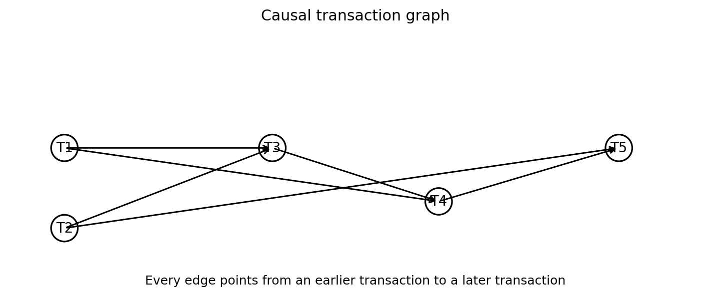
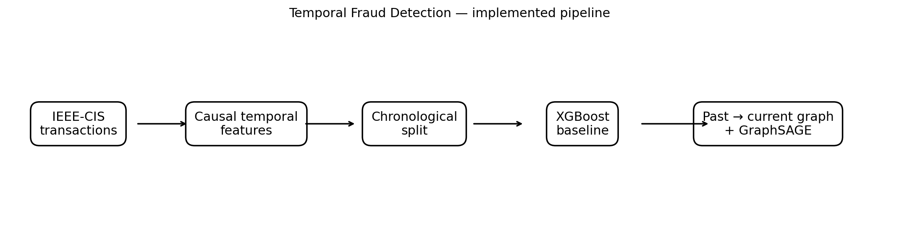
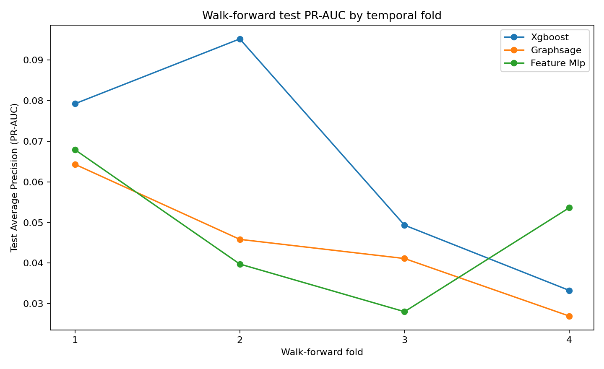

# Temporal Graph Learning for IEEE-CIS Fraud Detection

> A research-style fraud detection project comparing a causal temporal GraphSAGE model with strong tabular baselines on the IEEE-CIS dataset.

The project asks a specific question:

> **Does historical relational structure between transactions add predictive information beyond causal temporal/tabular features for fraud detection?**

The answer is evaluated empirically rather than assuming that the graph model must outperform the tabular baseline.

---

## Project overview

Each transaction is represented as a node. Historical relationships through `card1`, `addr1`, `DeviceInfo`, `P_emaildomain`, and `ProductCD` create directed **past → current** graph edges. The model only receives information that would have been available before the transaction being scored.

The experimental ladder contains:

1. Logistic Regression — linear control
2. HistGradientBoosting — nonlinear tabular control
3. XGBoost — strong production-style tabular baseline
4. Feature-only MLP — same causal features without message passing
5. GraphSAGE — causal relational model

This separation is important: if GraphSAGE improves over the feature-only MLP, the gain is more plausibly attributable to relational message passing rather than simply using a neural network.



---

## Methodological safeguards

The implementation is designed around temporal leakage prevention:

- transactions are sorted by `TransactionDT` and `TransactionID` before truncation;
- historical features use only prior events;
- missing categorical values never become shared graph entities;
- graph edges point strictly from past transactions to current transactions;
- duplicate edges are removed;
- the feature scaler is fitted on the training segment only;
- model and threshold selection are validation-only;
- the final test window is not used for model selection;
- walk-forward evaluation keeps later test events from becoming neighbors of earlier test events.

The temporal aspect is therefore **causal historical feature engineering + a directed temporal graph**. This is not presented as a full Temporal Graph Network (TGN) with persistent event memory.



---

# Results

Fraud is highly imbalanced, so the headline ranking metric is **Average Precision (AP / PR-AUC)** rather than accuracy. AP is reported together with the fraud prevalence and the lift over a random ranking baseline.

### 50k multi-model study — 3 seeds

The complete `ml_study_full` output contains 38 experiment rows because it includes the main models plus feature-group, history-depth, relation, and paired-comparison experiments. The table below deliberately shows only the **canonical main-model rows**: one result per seed for each model, with GraphSAGE using all five relations and `history_k=3`.

| Model | Seeds | Mean test AP | Std. dev. | Mean ROC-AUC |
|---|---:|---:|---:|---:|
| Logistic Regression | 3 | **0.05525** | 0.00000 | 0.6607 |
| GraphSAGE | 3 | **0.05194** | 0.00900 | 0.6491 |
| HistGradientBoosting | 3 | 0.03758 | 0.00107 | 0.6645 |
| XGBoost | 3 | 0.03532 | 0.00230 | 0.5879 |
| Feature-only MLP | 3 | 0.02738 | 0.00386 | 0.5857 |

**Interpretation:** in this particular 50k multi-seed study, GraphSAGE is competitive and has a higher mean AP than XGBoost, but it is not uniformly dominant: Logistic Regression has the highest mean AP among the canonical main-model rows. The GraphSAGE result also has noticeably larger seed-to-seed variability than XGBoost.

This study should **not** be treated as a direct replacement for the older single-split benchmark: the experimental protocols and model-selection procedures differ.

### Walk-forward temporal evaluation — 4 folds

The current walk-forward run used 50k chronologically ordered rows, 4 expanding folds, no gap, and 10 GraphSAGE/MLP training epochs.

| Model | Mean test AP | Std. dev. | Mean AP lift vs random |
|---|---:|---:|---:|
| XGBoost | **0.06427** | 0.02809 | **2.55×** |
| Feature-only MLP | 0.04733 | 0.01725 | 1.98× |
| GraphSAGE | 0.04456 | 0.01543 | 1.79× |

The fold-level results are:

| Fold | XGBoost AP | GraphSAGE AP | Feature MLP AP |
|---:|---:|---:|---:|
| 1 | **0.07927** | 0.06432 | 0.06791 |
| 2 | **0.09523** | 0.04584 | 0.03976 |
| 3 | **0.04934** | 0.04112 | 0.02802 |
| 4 | **0.03327** | 0.02695 | **0.05363** |



**Interpretation:** XGBoost is the strongest model in this temporal robustness run and remains above the random baseline on every fold. GraphSAGE also remains above random on every fold, but it does not beat XGBoost in any of these four test windows.

Importantly, this run used only **10 epochs** for the neural models. It is therefore evidence about the current configuration, not proof that the architecture has reached its maximum attainable performance.

---

## Operational fraud-review metrics

The project also reports precision and recall under fixed alert budgets. This is more meaningful than accuracy for a highly imbalanced fraud problem because a real review system can only investigate a limited fraction of transactions.

For the walk-forward evaluation, the 1% alert-budget results were:

| Fold | Model | Precision@1% | Recall@1% | AP lift |
|---:|---|---:|---:|---:|
| 1 | XGBoost | 22.67% | 8.29% | 2.90× |
| 1 | GraphSAGE | 12.00% | 4.39% | 2.35× |
| 2 | XGBoost | 25.33% | 9.31% | 3.50× |
| 2 | GraphSAGE | 6.67% | 2.45% | 1.69× |
| 3 | XGBoost | 12.00% | 4.97% | 2.04× |
| 3 | GraphSAGE | 5.33% | 2.21% | 1.70× |
| 4 | XGBoost | 9.33% | 4.90% | 1.74× |
| 4 | GraphSAGE | 1.33% | 0.70% | 1.41× |

The full CSV/JSON artifacts retain the 0.1%, 0.5%, 1%, 2%, and 5% alert-budget metrics.

---

## 50k benchmark visualization

The repository also contains the earlier 50k benchmark artifacts:


These figures are useful for visual interpretation, but the benchmark outputs and the multi-seed study are kept conceptually separate because they were produced under different experimental protocols.

---

## GraphSAGE history-depth study

The 50k full study also tested the number of historical neighbors retained per relation. For seed 42, using all five relations:

| History `k` | Validation AP | Test AP |
|---:|---:|---:|
| 1 | 0.06828 | 0.03357 |
| 3 | 0.08575 | 0.04156 |
| 5 | 0.09309 | 0.04142 |
| 10 | **0.09806** | **0.04206** |

The result suggests that increasing historical context can improve validation performance, but the test improvement from `k=3` to `k=10` is small. This is exactly why history depth should be evaluated as a controlled ablation rather than selected from the test set.

---

## Calibration

Ranking quality and probability calibration are treated separately.

In the bundled 50k benchmark artifact, validation-only Platt calibration left AP unchanged, as expected, while substantially improving probability calibration:

| Model | Raw Brier | Calibrated Brier | Raw ECE | Calibrated ECE |
|---|---:|---:|---:|---:|
| XGBoost | 0.02651 | 0.01874 | 0.0432 | 0.0089 |
| GraphSAGE | 0.13402 | 0.01854 | 0.3111 | 0.0062 |

Calibration parameters are fitted without using the final test labels for fitting or selection.

---

## What the current evidence actually says

The project intentionally does not force a GraphSAGE victory.

The current evidence is mixed:

- the older single-split 50k benchmark showed GraphSAGE ahead of XGBoost on test AP;
- the newer 50k multi-seed study still gives GraphSAGE a higher mean AP than XGBoost on the canonical rows, but with higher variability;
- the 4-fold walk-forward study currently favors XGBoost;
- GraphSAGE remains above the random AP baseline in every walk-forward fold;
- the feature-only MLP does not consistently outperform either model, so neural architecture alone does not explain the results;
- history-depth experiments show that graph context matters, but the optimal value is not yet established across multiple temporal folds.

This is a more defensible conclusion than claiming that a GNN is automatically superior to a strong tabular baseline.

---

# Reproducibility

## Test suite

```powershell
pytest -q
```

The repository's hardened test suite was previously validated with **14 passing tests**.

## Multi-model study

```powershell
python scripts/run_ml_study.py --data-dir data --max-rows 50000 --epochs 20 --suite full --seeds 42 123 456 --output-dir outputs\ml_study_full
```

## Walk-forward temporal evaluation

```powershell
python scripts/run_temporal_cv.py --data-dir data --max-rows 50000 --epochs 10 --output-dir outputs\walk_forward
```

## 100k benchmark

A 100k benchmark is supported but **has not been numerically reported in this repository**. Do not treat a smoke test as a final 100k result.

```powershell
New-Item -ItemType Directory -Force outputs\benchmark_100k
python scripts/run_experiment.py --data-dir data --dataset ieee_cis --max-rows 100000 --epochs 30 --history-k 3 --tune --graph-mode auto --output-dir outputs\benchmark_100k
```

For large graphs, `graph-mode=auto` can use PyTorch Geometric neighbor sampling when configured to do so.

---

# Repository documentation

- [`EXPERIMENTS.md`](EXPERIMENTS.md) — detailed experimental record and result interpretation
- [`RESEARCH_PROTOCOL.md`](RESEARCH_PROTOCOL.md) — predefined research protocol and anti-leakage rules
- [`RELEASE_NOTES.md`](RELEASE_NOTES.md) — changes introduced by the hardened research build
- [`outputs/README.md`](outputs/README.md) — explanation of generated experiment artifacts

---

# Project structure

```text
.
├── api/                    # API layer
├── artifacts/static/       # Documentation figures
├── data/                   # Dataset files / data instructions
├── outputs/                # Experiment outputs and plots
├── scripts/                # Reproducible experiment runners
├── src/                    # Feature, graph, model, training and evaluation code
├── tests/                  # Automated tests
├── EXPERIMENTS.md
├── RESEARCH_PROTOCOL.md
├── RELEASE_NOTES.md
└── README.md
```

---

## Scope and limitations

This is a research/portfolio implementation, not a production fraud service. The reported numbers depend on the IEEE-CIS data subset, temporal windows, feature construction, graph relations, hyperparameters, seeds, and compute environment.

The most important remaining empirical questions are whether GraphSAGE improves with a longer training budget under the same walk-forward protocol, which graph relations and history depths are genuinely useful, and whether any advantage survives additional temporal folds and seeds.
